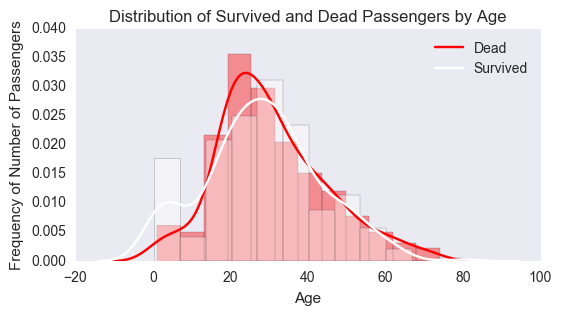

# Investigate Titanic Survivors Data

Inquisitively posed questions on the dataset, then Utilized Python Matplotlib, NumPy, Pandas to answer the questions based on the data and created an IPython Notebook report to share the results.


### Questions about the titanic data
  1. What's the average prices for each class?
  1. How many children less than 5 years have no parents accompanied?
  1. Correlation between age and social class(Pclass)?
  1. How many adult single ladies are on board?
  1. Which port holds the richest/poorest passengers?
  1. Are there more men survived than women, or otherwise? (number-wise, percentage-wise)
  1. What are the survival rates in 3 classes?
  1. Survived passengers' age distribution? (histogram)
  1. What's the survival rate over the age?


```python
%matplotlib inline

import numpy as np
import pandas as pd
import matplotlib.pyplot as plt
import seaborn as sns
```


```python
filename = '~/AnacondaProjects/udacity/3P_titanic/titanic-data.csv'
data = pd.read_csv(filename)
```


```python
data.head()
```


<div>
<table border="1" class="dataframe">
  <thead>
    <tr style="text-align: right;">
      <th></th>
      <th>PassengerId</th>
      <th>Survived</th>
      <th>Pclass</th>
      <th>Name</th>
      <th>Sex</th>
      <th>Age</th>
      <th>SibSp</th>
      <th>Parch</th>
      <th>Ticket</th>
      <th>Fare</th>
      <th>Cabin</th>
      <th>Embarked</th>
    </tr>
  </thead>
  <tbody>
    <tr>
      <th>0</th>
      <td>1</td>
      <td>0</td>
      <td>3</td>
      <td>Braund, Mr. Owen Harris</td>
      <td>male</td>
      <td>22.0</td>
      <td>1</td>
      <td>0</td>
      <td>A/5 21171</td>
      <td>7.2500</td>
      <td>NaN</td>
      <td>S</td>
    </tr>
    <tr>
      <th>1</th>
      <td>2</td>
      <td>1</td>
      <td>1</td>
      <td>Cumings, Mrs. John Bradley (Florence Briggs Th...</td>
      <td>female</td>
      <td>38.0</td>
      <td>1</td>
      <td>0</td>
      <td>PC 17599</td>
      <td>71.2833</td>
      <td>C85</td>
      <td>C</td>
    </tr>
    <tr>
      <th>2</th>
      <td>3</td>
      <td>1</td>
      <td>3</td>
      <td>Heikkinen, Miss. Laina</td>
      <td>female</td>
      <td>26.0</td>
      <td>0</td>
      <td>0</td>
      <td>STON/O2. 3101282</td>
      <td>7.9250</td>
      <td>NaN</td>
      <td>S</td>
    </tr>
    <tr>
      <th>3</th>
      <td>4</td>
      <td>1</td>
      <td>1</td>
      <td>Futrelle, Mrs. Jacques Heath (Lily May Peel)</td>
      <td>female</td>
      <td>35.0</td>
      <td>1</td>
      <td>0</td>
      <td>113803</td>
      <td>53.1000</td>
      <td>C123</td>
      <td>S</td>
    </tr>
    <tr>
      <th>4</th>
      <td>5</td>
      <td>0</td>
      <td>3</td>
      <td>Allen, Mr. William Henry</td>
      <td>male</td>
      <td>35.0</td>
      <td>0</td>
      <td>0</td>
      <td>373450</td>
      <td>8.0500</td>
      <td>NaN</td>
      <td>S</td>
    </tr>
  </tbody>
</table>
</div>


```python
data.dtypes
```


    PassengerId      int64
    Survived         int64
    Pclass           int64
    Name            object
    Sex             object
    Age            float64
    SibSp            int64
    Parch            int64
    Ticket          object
    Fare           float64
    Cabin           object
    Embarked        object
    dtype: object


```python
data.isnull().sum()
```


    PassengerId      0
    Survived         0
    Pclass           0
    Name             0
    Sex              0
    Age            177
    SibSp            0
    Parch            0
    Ticket           0
    Fare             0
    Cabin          687
    Embarked         2
    dtype: int64


* The columns of **_Age_**, **_Cabin_** and **_Embarked_** have missing values.

### Take a look of the numerical columns


```python
data.describe(include=[np.number])
```


<div>
<table border="1" class="dataframe">
  <thead>
    <tr style="text-align: right;">
      <th></th>
      <th>PassengerId</th>
      <th>Survived</th>
      <th>Pclass</th>
      <th>Age</th>
      <th>SibSp</th>
      <th>Parch</th>
      <th>Fare</th>
    </tr>
  </thead>
  <tbody>
    <tr>
      <th>count</th>
      <td>891.000000</td>
      <td>891.000000</td>
      <td>891.000000</td>
      <td>714.000000</td>
      <td>891.000000</td>
      <td>891.000000</td>
      <td>891.000000</td>
    </tr>
    <tr>
      <th>mean</th>
      <td>446.000000</td>
      <td>0.383838</td>
      <td>2.308642</td>
      <td>29.699118</td>
      <td>0.523008</td>
      <td>0.381594</td>
      <td>32.204208</td>
    </tr>
    <tr>
      <th>std</th>
      <td>257.353842</td>
      <td>0.486592</td>
      <td>0.836071</td>
      <td>14.526497</td>
      <td>1.102743</td>
      <td>0.806057</td>
      <td>49.693429</td>
    </tr>
    <tr>
      <th>min</th>
      <td>1.000000</td>
      <td>0.000000</td>
      <td>1.000000</td>
      <td>0.420000</td>
      <td>0.000000</td>
      <td>0.000000</td>
      <td>0.000000</td>
    </tr>
    <tr>
      <th>25%</th>
      <td>223.500000</td>
      <td>0.000000</td>
      <td>2.000000</td>
      <td>20.125000</td>
      <td>0.000000</td>
      <td>0.000000</td>
      <td>7.910400</td>
    </tr>
    <tr>
      <th>50%</th>
      <td>446.000000</td>
      <td>0.000000</td>
      <td>3.000000</td>
      <td>28.000000</td>
      <td>0.000000</td>
      <td>0.000000</td>
      <td>14.454200</td>
    </tr>
    <tr>
      <th>75%</th>
      <td>668.500000</td>
      <td>1.000000</td>
      <td>3.000000</td>
      <td>38.000000</td>
      <td>1.000000</td>
      <td>0.000000</td>
      <td>31.000000</td>
    </tr>
    <tr>
      <th>max</th>
      <td>891.000000</td>
      <td>1.000000</td>
      <td>3.000000</td>
      <td>80.000000</td>
      <td>8.000000</td>
      <td>6.000000</td>
      <td>512.329200</td>
    </tr>
  </tbody>
</table>
</div>


```python
data[data['Parch']==6]
```


<div>
<table border="1" class="dataframe">
  <thead>
    <tr style="text-align: right;">
      <th></th>
      <th>PassengerId</th>
      <th>Survived</th>
      <th>Pclass</th>
      <th>Name</th>
      <th>Sex</th>
      <th>Age</th>
      <th>SibSp</th>
      <th>Parch</th>
      <th>Ticket</th>
      <th>Fare</th>
      <th>Cabin</th>
      <th>Embarked</th>
    </tr>
  </thead>
  <tbody>
    <tr>
      <th>678</th>
      <td>679</td>
      <td>0</td>
      <td>3</td>
      <td>Goodwin, Mrs. Frederick (Augusta Tyler)</td>
      <td>female</td>
      <td>43.0</td>
      <td>1</td>
      <td>6</td>
      <td>CA 2144</td>
      <td>46.9</td>
      <td>NaN</td>
      <td>S</td>
    </tr>
  </tbody>
</table>
</div>


+ The Goodwin family has 6 children.


```python
data[data['SibSp']==8]
```


<div>
<table border="1" class="dataframe">
  <thead>
    <tr style="text-align: right;">
      <th></th>
      <th>PassengerId</th>
      <th>Survived</th>
      <th>Pclass</th>
      <th>Name</th>
      <th>Sex</th>
      <th>Age</th>
      <th>SibSp</th>
      <th>Parch</th>
      <th>Ticket</th>
      <th>Fare</th>
      <th>Cabin</th>
      <th>Embarked</th>
    </tr>
  </thead>
  <tbody>
    <tr>
      <th>159</th>
      <td>160</td>
      <td>0</td>
      <td>3</td>
      <td>Sage, Master. Thomas Henry</td>
      <td>male</td>
      <td>NaN</td>
      <td>8</td>
      <td>2</td>
      <td>CA. 2343</td>
      <td>69.55</td>
      <td>NaN</td>
      <td>S</td>
    </tr>
    <tr>
      <th>180</th>
      <td>181</td>
      <td>0</td>
      <td>3</td>
      <td>Sage, Miss. Constance Gladys</td>
      <td>female</td>
      <td>NaN</td>
      <td>8</td>
      <td>2</td>
      <td>CA. 2343</td>
      <td>69.55</td>
      <td>NaN</td>
      <td>S</td>
    </tr>
    <tr>
      <th>201</th>
      <td>202</td>
      <td>0</td>
      <td>3</td>
      <td>Sage, Mr. Frederick</td>
      <td>male</td>
      <td>NaN</td>
      <td>8</td>
      <td>2</td>
      <td>CA. 2343</td>
      <td>69.55</td>
      <td>NaN</td>
      <td>S</td>
    </tr>
    <tr>
      <th>324</th>
      <td>325</td>
      <td>0</td>
      <td>3</td>
      <td>Sage, Mr. George John Jr</td>
      <td>male</td>
      <td>NaN</td>
      <td>8</td>
      <td>2</td>
      <td>CA. 2343</td>
      <td>69.55</td>
      <td>NaN</td>
      <td>S</td>
    </tr>
    <tr>
      <th>792</th>
      <td>793</td>
      <td>0</td>
      <td>3</td>
      <td>Sage, Miss. Stella Anna</td>
      <td>female</td>
      <td>NaN</td>
      <td>8</td>
      <td>2</td>
      <td>CA. 2343</td>
      <td>69.55</td>
      <td>NaN</td>
      <td>S</td>
    </tr>
    <tr>
      <th>846</th>
      <td>847</td>
      <td>0</td>
      <td>3</td>
      <td>Sage, Mr. Douglas Bullen</td>
      <td>male</td>
      <td>NaN</td>
      <td>8</td>
      <td>2</td>
      <td>CA. 2343</td>
      <td>69.55</td>
      <td>NaN</td>
      <td>S</td>
    </tr>
    <tr>
      <th>863</th>
      <td>864</td>
      <td>0</td>
      <td>3</td>
      <td>Sage, Miss. Dorothy Edith "Dolly"</td>
      <td>female</td>
      <td>NaN</td>
      <td>8</td>
      <td>2</td>
      <td>CA. 2343</td>
      <td>69.55</td>
      <td>NaN</td>
      <td>S</td>
    </tr>
  </tbody>
</table>
</div>


+ The biggest family is the Sage family, they have totally 8+2+1=11 family members on board.

+ Interestingly there are people on board with free tickets, since the min of Fare is 0.


```python
data[data['Fare']==0]
```


<div>
<table border="1" class="dataframe">
  <thead>
    <tr style="text-align: right;">
      <th></th>
      <th>PassengerId</th>
      <th>Survived</th>
      <th>Pclass</th>
      <th>Name</th>
      <th>Sex</th>
      <th>Age</th>
      <th>SibSp</th>
      <th>Parch</th>
      <th>Ticket</th>
      <th>Fare</th>
      <th>Cabin</th>
      <th>Embarked</th>
    </tr>
  </thead>
  <tbody>
    <tr>
      <th>179</th>
      <td>180</td>
      <td>0</td>
      <td>3</td>
      <td>Leonard, Mr. Lionel</td>
      <td>male</td>
      <td>36.0</td>
      <td>0</td>
      <td>0</td>
      <td>LINE</td>
      <td>0.0</td>
      <td>NaN</td>
      <td>S</td>
    </tr>
    <tr>
      <th>263</th>
      <td>264</td>
      <td>0</td>
      <td>1</td>
      <td>Harrison, Mr. William</td>
      <td>male</td>
      <td>40.0</td>
      <td>0</td>
      <td>0</td>
      <td>112059</td>
      <td>0.0</td>
      <td>B94</td>
      <td>S</td>
    </tr>
    <tr>
      <th>271</th>
      <td>272</td>
      <td>1</td>
      <td>3</td>
      <td>Tornquist, Mr. William Henry</td>
      <td>male</td>
      <td>25.0</td>
      <td>0</td>
      <td>0</td>
      <td>LINE</td>
      <td>0.0</td>
      <td>NaN</td>
      <td>S</td>
    </tr>
    <tr>
      <th>277</th>
      <td>278</td>
      <td>0</td>
      <td>2</td>
      <td>Parkes, Mr. Francis "Frank"</td>
      <td>male</td>
      <td>NaN</td>
      <td>0</td>
      <td>0</td>
      <td>239853</td>
      <td>0.0</td>
      <td>NaN</td>
      <td>S</td>
    </tr>
    <tr>
      <th>302</th>
      <td>303</td>
      <td>0</td>
      <td>3</td>
      <td>Johnson, Mr. William Cahoone Jr</td>
      <td>male</td>
      <td>19.0</td>
      <td>0</td>
      <td>0</td>
      <td>LINE</td>
      <td>0.0</td>
      <td>NaN</td>
      <td>S</td>
    </tr>
    <tr>
      <th>413</th>
      <td>414</td>
      <td>0</td>
      <td>2</td>
      <td>Cunningham, Mr. Alfred Fleming</td>
      <td>male</td>
      <td>NaN</td>
      <td>0</td>
      <td>0</td>
      <td>239853</td>
      <td>0.0</td>
      <td>NaN</td>
      <td>S</td>
    </tr>
    <tr>
      <th>466</th>
      <td>467</td>
      <td>0</td>
      <td>2</td>
      <td>Campbell, Mr. William</td>
      <td>male</td>
      <td>NaN</td>
      <td>0</td>
      <td>0</td>
      <td>239853</td>
      <td>0.0</td>
      <td>NaN</td>
      <td>S</td>
    </tr>
    <tr>
      <th>481</th>
      <td>482</td>
      <td>0</td>
      <td>2</td>
      <td>Frost, Mr. Anthony Wood "Archie"</td>
      <td>male</td>
      <td>NaN</td>
      <td>0</td>
      <td>0</td>
      <td>239854</td>
      <td>0.0</td>
      <td>NaN</td>
      <td>S</td>
    </tr>
    <tr>
      <th>597</th>
      <td>598</td>
      <td>0</td>
      <td>3</td>
      <td>Johnson, Mr. Alfred</td>
      <td>male</td>
      <td>49.0</td>
      <td>0</td>
      <td>0</td>
      <td>LINE</td>
      <td>0.0</td>
      <td>NaN</td>
      <td>S</td>
    </tr>
    <tr>
      <th>633</th>
      <td>634</td>
      <td>0</td>
      <td>1</td>
      <td>Parr, Mr. William Henry Marsh</td>
      <td>male</td>
      <td>NaN</td>
      <td>0</td>
      <td>0</td>
      <td>112052</td>
      <td>0.0</td>
      <td>NaN</td>
      <td>S</td>
    </tr>
    <tr>
      <th>674</th>
      <td>675</td>
      <td>0</td>
      <td>2</td>
      <td>Watson, Mr. Ennis Hastings</td>
      <td>male</td>
      <td>NaN</td>
      <td>0</td>
      <td>0</td>
      <td>239856</td>
      <td>0.0</td>
      <td>NaN</td>
      <td>S</td>
    </tr>
    <tr>
      <th>732</th>
      <td>733</td>
      <td>0</td>
      <td>2</td>
      <td>Knight, Mr. Robert J</td>
      <td>male</td>
      <td>NaN</td>
      <td>0</td>
      <td>0</td>
      <td>239855</td>
      <td>0.0</td>
      <td>NaN</td>
      <td>S</td>
    </tr>
    <tr>
      <th>806</th>
      <td>807</td>
      <td>0</td>
      <td>1</td>
      <td>Andrews, Mr. Thomas Jr</td>
      <td>male</td>
      <td>39.0</td>
      <td>0</td>
      <td>0</td>
      <td>112050</td>
      <td>0.0</td>
      <td>A36</td>
      <td>S</td>
    </tr>
    <tr>
      <th>815</th>
      <td>816</td>
      <td>0</td>
      <td>1</td>
      <td>Fry, Mr. Richard</td>
      <td>male</td>
      <td>NaN</td>
      <td>0</td>
      <td>0</td>
      <td>112058</td>
      <td>0.0</td>
      <td>B102</td>
      <td>S</td>
    </tr>
    <tr>
      <th>822</th>
      <td>823</td>
      <td>0</td>
      <td>1</td>
      <td>Reuchlin, Jonkheer. John George</td>
      <td>male</td>
      <td>38.0</td>
      <td>0</td>
      <td>0</td>
      <td>19972</td>
      <td>0.0</td>
      <td>NaN</td>
      <td>S</td>
    </tr>
  </tbody>
</table>
</div>


+ In our dataset, free ticket holders come from different classes, but they are all male and embarked from Southampton.


```python
# How many passengers survived
num_survived = data['Survived'].sum()

# How many passengers didn't survive
num_dead = len(data) - num_survived

print '# of Survived:', num_survived
print '# of Dead:', num_dead
```

    # of Survived: 342
    # of Dead: 549


### 1. The average ticket price for each class


```python
data.groupby('Pclass')['Fare'].mean()
```


    Pclass
    1    84.154687
    2    20.662183
    3    13.675550
    Name: Fare, dtype: float64


### 2. How many children less than 5 years have no parents accompanied?


```python
kids = data['Age'] < 5
no_parent = data['Parch'] == 0
survived = data['Survived'] == 1

print 'Kids under 5:', sum(kids)
print 'Kids under 5 without guardians:', sum(kids & no_parent)
print 'Kids under 5 that survived:', sum(kids & survived)
```

    Kids under 5: 40
    Kids under 5 without guardians: 0
    Kids under 5 that survived: 27


+ 40 children under 5 years old were on the ship.
+ Luckily every one of them had their parent(s) with them.
+ Sadly only 27 of them survived.

### 3. Correlation between age and social class(Pclass)


```python
data.groupby('Pclass')['Age'].mean()
```


    Pclass
    1    38.233441
    2    29.877630
    3    25.140620
    Name: Age, dtype: float64


Since 177 values are missing in clomun "Age", an imputation is performed with the median.


```python
x = data['Pclass']
y = data.fillna(data.median()['Age'])['Age']

np.corrcoef(x, y)
```


    array([[ 1.        , -0.33989833],
           [-0.33989833,  1.        ]])


Another method is a simple exclusion of the observations with missing ages.


```python
y = data['Age'].dropna()
x = data['Pclass'][y.index]

np.corrcoef(x, y)
```


    array([[ 1.        , -0.36922602],
           [-0.36922602,  1.        ]])


[ *Working with Missing Data: https://pandas.pydata.org/pandas-docs/stable/missing_data.html#dropping-axis-labels-with-missing-data-dropna* ]


```python
sns.set_style('whitegrid')
sns.plt.title('The Distribution of Panssengers\' Ages across 3 Classes')
sns.violinplot(x, y)
```


    <matplotlib.axes._subplots.AxesSubplot at 0x10daf55d0>


[ *seaborn.violinplot(): https://seaborn.pydata.org/generated/seaborn.violinplot.html* ]

+ Although the mean of the ages increases while the class goes higher, the correlation between age and social class is not noticably great. From the violin plot, the ages spread out from 0 to 80 in all 3 classes, but we could see a slight clibming from class 3 to class 1.

### 4. How many adult single ladies are on board?


```python
# Find names that contain "Miss", indicating the lady is unmarried.

import re

def find_miss(name):
    if re.search(r'\w*\sMiss.\s\w*', name):
        return True
    else:
        return False
    
#data['Name'].apply(find_miss)
```

[ *Google Python Class - Regular Expression: https://developers.google.com/edu/python/regular-expressions* ]


```python
c = (data['Sex'] == 'female') & (data['Age'] >= 18) & (data['Name'].apply(find_miss))

print 'Number of single ladies:', data[c].shape[0]
print 'Number of survived:', data[c]['Survived'].sum()
```

    Number of single ladies: 95
    Number of survived: 71


+ 95 unmarried ladies are found in the dataset. Most of them (71) survied. Ladies without prefix recorded are not included.

###   5. Which port holds the richest/poorest passengers?


```python
data.groupby('Embarked')['Fare'].mean()
```


    Embarked
    C    59.954144
    Q    13.276030
    S    27.079812
    Name: Fare, dtype: float64


```python
fig, ax = plt.subplots(figsize=(12, 3))

ax = sns.boxplot(x = data['Fare'], y = data['Embarked'], orient = 'h')

ax.set_title('Boxplot of Passengers Embarked from 3 Ports')
ax.set_ylabel('Embarked Ports')
ax.set_yticklabels(['Southampton', 'Cherbourg', 'Queenstown'])

#data[['Embarked', 'Fare']].boxplot(column='Fare', by='Embarked', vert=False, figsize=(10,4))
```


    [<matplotlib.text.Text at 0x10ec008d0>,
     <matplotlib.text.Text at 0x10ec09850>,
     <matplotlib.text.Text at 0x10ecafd50>]


[ *seaborn.boxplot: https://seaborn.pydata.org/generated/seaborn.boxplot.html* ]

+ From the mean fare and the boxplot, passengers embarking from Cherbourg paid the most for their tickets, and possibly the richest. On the other hand, people from Queenstown afforded the lowest rate for tickets.

### 6. Are women more likely to survive than men?


```python
data['Sex'].value_counts()
```


    male      577
    female    314
    Name: Sex, dtype: int64


+ There are 577 men and 314 women in our dataset.


```python
# Passengers grouped by Sex and whether survived or not
data.groupby(['Survived', 'Sex'])['PassengerId'].count()
```


    Survived  Sex   
    0         female     81
              male      468
    1         female    233
              male      109
    Name: PassengerId, dtype: int64


+ __74.2%__ women survived, while only __18.89%__ men did. Women are more likely to survive than men.

### 7. Were people treated equally in different classes?


```python
data.groupby(['Survived', 'Pclass'])['PassengerId'].count()
```


    Survived  Pclass
    0         1          80
              2          97
              3         372
    1         1         136
              2          87
              3         119
    Name: PassengerId, dtype: int64


+ __62.96%__ of 1st class passengers survived
+ __47.28%__ of 2nd class passengers survived
+ __24.24%__ of 3rd class passengers survived

*People in higher class cabins are more likely to survive. *

#### Two figures to show the number of survived vs. non-survived passengers by sex and class.


```python
fig1, (ax1, ax2) = plt.subplots(1, 2, figsize=(9, 3.5))

sns.countplot(x = 'Sex', hue = 'Survived', data = data, ax = ax1, palette = sns.color_palette("RdBu", n_colors=3))
ax1.set(title = 'Number of Passengers by Sex', ylabel = 'Number of Passengers')

sns.countplot(x = 'Pclass', hue = 'Survived', data = data, ax = ax2, palette = sns.color_palette("RdBu", n_colors=3))
ax2.set(title = 'Number of Passengers by Class', ylabel = 'Number of Passengers')

fig1.tight_layout()
```


[ *matplotlib.pyplot.subplots: https://matplotlib.org/devdocs/api/_as_gen/matplotlib.pyplot.subplots.html* ]

[ *seaborn.countplot(): https://seaborn.pydata.org/generated/seaborn.countplot.html* ]

### 8. Survived passengers' age distribution? (histogram)


```python
print data.groupby('Survived').mean()['Age']
print data.groupby('Survived').min()['Age']
print data.groupby('Survived').max()['Age']
```

    Survived
    0    30.626179
    1    28.343690
    Name: Age, dtype: float64
    Survived
    0    1.00
    1    0.42
    Name: Age, dtype: float64
    Survived
    0    74.0
    1    80.0
    Name: Age, dtype: float64


```python
d = data.groupby('Survived', as_index = True).groups[0]
s = data.groupby('Survived', as_index = True).groups[1]

sns.set_style('dark')
fig, ax = plt.subplots(figsize=(6, 3))
ax.set(title = 'Distribution of Survived and Dead Passengers by Age', ylabel = 'Frequency of Number of Passengers')

ax = sns.distplot(data['Age'][d].dropna(), bins=12, color='r')
ax = sns.distplot(data['Age'][s].dropna(), bins=12, color='w')

ax.legend(handles=ax.lines[0:2], labels=["Dead","Survived"])
```


    <matplotlib.legend.Legend at 0x10db1b190>





[ *seaborn.distplot(): https://seaborn.pydata.org/generated/seaborn.distplot.html* ]

[ *matplotlib.axes.Axes.legend: https://matplotlib.org/api/_as_gen/matplotlib.axes.Axes.legend.html* ]

+ From the calculated statistics, the youngest and oldest passengers survived. People survived are slightly younger on average.
+ From the histogram above, People on their 20s are least likely to survive, while people around 30 are most likely to survive.
+ The histogram in white (survived passengers' ages) follows a multimodal distribution with the first peak around 0, which means babies are most likely to survive.

### 9. What's the survival rate over the age?


```python
ag = pd.cut(data['Age'], bins = range(0, 81, 5)) # age_group

sr = (data.groupby(ag).sum()['Survived']/data.groupby(ag).count()['Age']).reset_index(name='rate') #survival_rate
```

[ *pandas.cut: http://pandas.pydata.org/pandas-docs/stable/generated/pandas.cut.html* ]

[ *Converting a Pandas GroupBy object to DataFrame: https://stackoverflow.com/questions/10373660/converting-a-pandas-groupby-object-to-dataframe* ]


```python
sns.set_style('whitegrid')
fig, ax = plt.subplots(figsize=(16, 5))
ax.set_title('Survival Rate Over Age Groups')
ax.set(xlabel='Age Group', ylabel='Survival Rate', xticks=np.arange(16), xticklabels=sr['Age'])

ax = sr['rate'].plot()
```


[ *plot set: https://seaborn.pydata.org/examples/many_facets.html* ]


```python
sr # survival rate dataframe shown as a table
```


<div>
<table border="1" class="dataframe">
  <thead>
    <tr style="text-align: right;">
      <th></th>
      <th>Age</th>
      <th>rate</th>
    </tr>
  </thead>
  <tbody>
    <tr>
      <th>0</th>
      <td>(0, 5]</td>
      <td>0.704545</td>
    </tr>
    <tr>
      <th>1</th>
      <td>(5, 10]</td>
      <td>0.350000</td>
    </tr>
    <tr>
      <th>2</th>
      <td>(10, 15]</td>
      <td>0.578947</td>
    </tr>
    <tr>
      <th>3</th>
      <td>(15, 20]</td>
      <td>0.343750</td>
    </tr>
    <tr>
      <th>4</th>
      <td>(20, 25]</td>
      <td>0.344262</td>
    </tr>
    <tr>
      <th>5</th>
      <td>(25, 30]</td>
      <td>0.388889</td>
    </tr>
    <tr>
      <th>6</th>
      <td>(30, 35]</td>
      <td>0.465909</td>
    </tr>
    <tr>
      <th>7</th>
      <td>(35, 40]</td>
      <td>0.417910</td>
    </tr>
    <tr>
      <th>8</th>
      <td>(40, 45]</td>
      <td>0.361702</td>
    </tr>
    <tr>
      <th>9</th>
      <td>(45, 50]</td>
      <td>0.410256</td>
    </tr>
    <tr>
      <th>10</th>
      <td>(50, 55]</td>
      <td>0.416667</td>
    </tr>
    <tr>
      <th>11</th>
      <td>(55, 60]</td>
      <td>0.388889</td>
    </tr>
    <tr>
      <th>12</th>
      <td>(60, 65]</td>
      <td>0.285714</td>
    </tr>
    <tr>
      <th>13</th>
      <td>(65, 70]</td>
      <td>0.000000</td>
    </tr>
    <tr>
      <th>14</th>
      <td>(70, 75]</td>
      <td>0.000000</td>
    </tr>
    <tr>
      <th>15</th>
      <td>(75, 80]</td>
      <td>1.000000</td>
    </tr>
  </tbody>
</table>
</div>


+ From the line chart and the Survival Rate table, infants had the highest survival rate. Teenagers between 10-15 years old also had more than 50% survival rate. One 80-year-old passenger survived, but people above 65 hardly had chance to survive.

### Conclusion
#### What I Get:
In this dataset, 342 people survived, while 549 didn’t.

The dataset has 177 missing values for Age, 687 missing values for Cabin, and 2 missing values for Embarked.

Some people travel alone, some with spouse, siblings, parents or children. The biggest family is the Sage with 11 members on board. There’re 15 men that embarked the ship with free tickets. All the them were from Southampton.

The tickets for Class 1 are much more expensive than the other 2 classes, but the prices between class 2 and 3 doesn’t have a huge gap. Passengers embarking from Cherbourg are the richest, while the ones from Queenstown is the poorest.

Averagely older people tended to be on higher classes, but the correlation between age and class is not significantly strong. 62.96% of 1st class passengers survived. 47.28% of 2nd class passengers survived. 24.24% of 3rd class passengers survived. People from higher class were more likely to survived than the others.

95 single ladies were on the ship. 71 of them survived. 74.2% women survived, but only 18.89% men did.

The youngest passenger is 5-month-old (0.42-year-old), while the oldest passenger is 80 years old. The median age is 28. 40 children under 5 years old were on the ship, and 27 of them survived. They all had their parents accompanied. Younger passengers, especially infants and toddlers are most likely to survive. The survival rate decreases when the age gets older. People above 65 hardly survived. Everything has an exception, the oldest passenger survived.

Women, children, high class passengers were more likely to survive than the others, basically the same as depicted in the movie Titanic.
#### What I Lack:
Since this is only a portion of the full data. New findings or more accurate statistics may be found from the full dataset. The missing values (especially of Age) also performs effect on the result drawn from the data.

Some other interesting dierections could be explored in the future. How does family size correalte with the other varialbes? Are there more women in each class than men? Given the conditions of one person, is any reasonable prediction possible to tell the fate?
